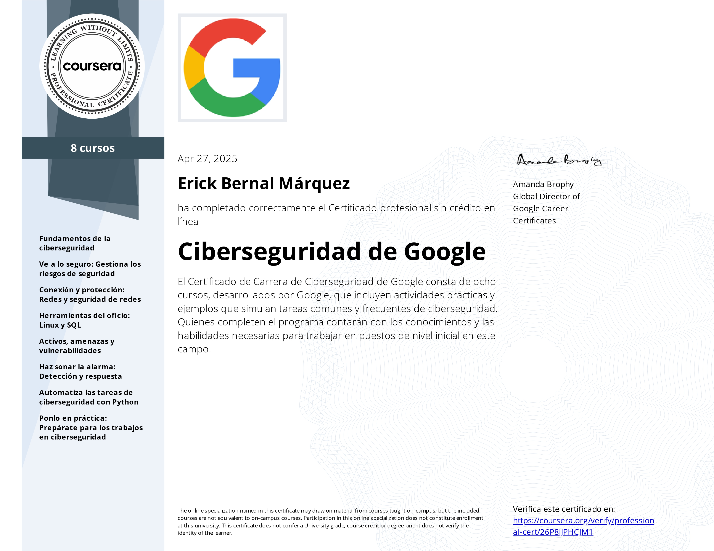
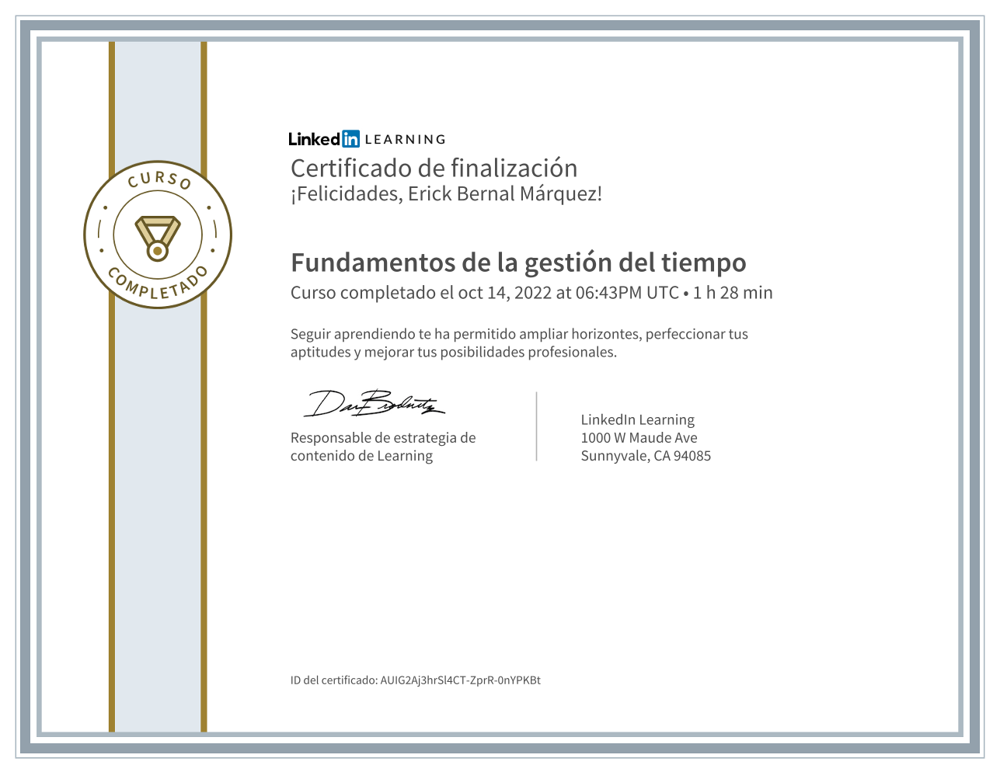
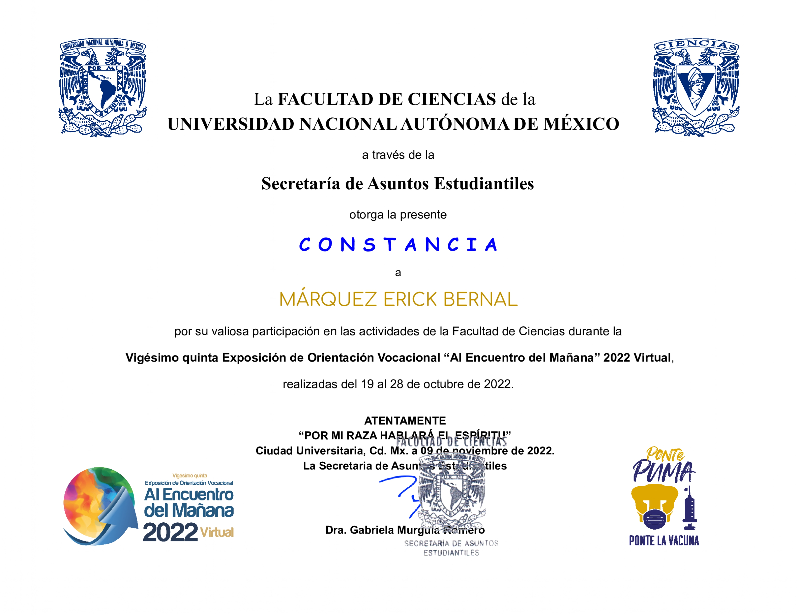

# 📜 Constancias y Certificaciones

Aquí se muestran algunas de mis constancias y certificaciones.  
Haz clic en cada imagen o título para ver el documento completo o validación oficial.

## ⭐ Certificaciones Destacadas

**Certificado Profesional en Ciberseguridad – Google (Coursera)**  
Programa de 8 cursos enfocado en fundamentos de ciberseguridad, investigación digital, redes y automatización con Python.

---

## 🔐 Ciberseguridad

**Enumeración de red con Nmap – Hack The Box Academy**

**Introducción a bash scripting – Hack The Box Academy**

**Peticiones web – Hack The Box Academy**

---

## 💻 Programación y Desarrollo

[![Git y GitHub – Oracle + Alura Latam]](https://app.aluracursos.com/certificate/dayan-stiker/git-github-control-version)
**Git y GitHub: Control de versiones – Oracle + Alura Latam**

---

## 🧠 Habilidades Profesionales

**Gestión de Tiempo – LinkedIn Learning**

---

## 🤝 Voluntariado

**Voluntariado Educativo "Al Encuentro del Mañana" – UNAM (2022)**